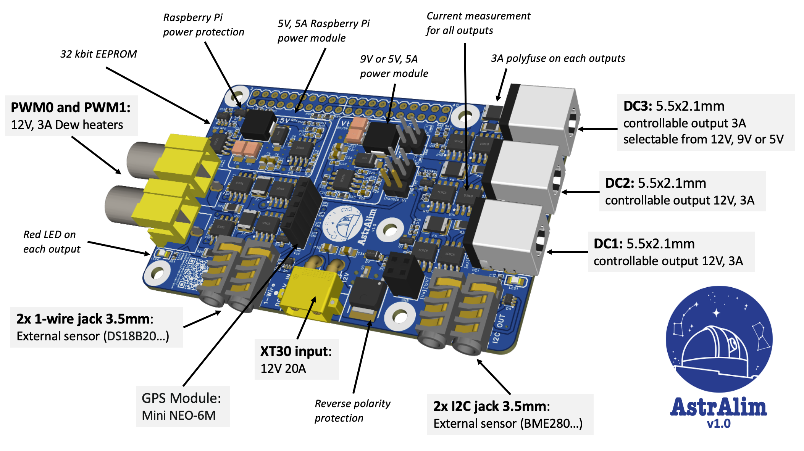

Project is published here : <https://oshwlab.com/pololamag/nafa-astralim>

**AstrAlim Hardware** : a telescope astrophotgraphy controller
# Description:

Designed for amateur astronomers and inspired by the [NAFA-Hardware](https://github.com/Patrick-81/NAFABox) (Nomad Astronomy For All) hardware solution, AstrAlim is an add-on module made for the Raspberry Pi 5 or 4 minicomputer, specifically designed to manage the electrical aspects of astrophotography sessions. The idea for this electronic card came from a few members of the [Vélizy astronomy club](https://www.astro-velizy.fr/) (France) who wanted to rationalise and simplify the use of cables for deep-sky night photography, with an open-source solution.

This all-in-one HAT (Hardware Attached on Top) offers the following features:

- **A single 12V DC, 15A input** in XT30 format streamlines the power supply for the entire photo session, reducing complications and cable chafing as the telescope moves. It includes polarity protection.
- **A 5V, 5A** power supply to power the Raspberry Pi.
- **Three controllable (ON/OFF) 12V DC outputs**, up to 36W, in DC Jack 2.1x5.5mm format for cameras, focusers, and filter wheels. For one of these outputs, the voltage can be selected between 12V, 9V or 5V. Each output has current measurement via an INA219, and a self-resetting fuse secures the outgoing current up to 3A.
- **Two 12V PWM outputs**, up to 36W, in RCA/Cinch format to power up to two dew heaters, controllable to adjust their respective power levels. The current for each of these two outputs is also measured by an INA219, and a self-resetting fuse secures the outgoing current up to 3A.
- **Five red LEDs** provide visual feedback on the status of the various outputs.
- **Two 1-wire** and **two I2C** outputs for triggering and adjusting the dew point heaters according to the local dew point, by connecting temperature (DS18B20...) and humidity (BME280...) sensors, or other functions requiring these buses. ESD protection is included on these 4 outputs.
- **A 5-pin female** connector for a mini **NEO-6M GPS module**, with a PPS (Pulse Per Second) output connected to the Raspberry Pi, providing accurate time and positioning for mobile astrophotography sessions, as well as the precision required for occultation measurements.
- A 32kbits EEPROM enables the Raspberry Pi to recognise AstrAlim at start-up and to run the scripts required for its operation.
- A 2x3p female connector with direct output, enabling another stacked HAT to retrieve a 12V voltage. For example, the AstrOnStep HAT uses this output to power itself.

 In short, with the Raspberry Pi 5 (or 4), AstrAlim offers a reliable, flexible, powerful and energy-efficient solution, ideal for both fixed installations and mobile use. This board also lets you forget about conventional and expensive proprietary systems, by providing all the functions you might need to capture your most beautiful images.

The software is currently being developed and finalised on github. One of our medium-term objectives will be to combine this card with the equatorial mount [DHEM, for DIY Harmonic Equatorial Mount](https://github.com/polvinc/DHEM).

Some statistics: 4 layers of copper, 132 components, 1.7m of track, 222 vias, 482 pads, 48 resistors, 26 capacitors, 5 transistors, 5 MOSFETs, 5 polyfuses, 5 LEDs...
