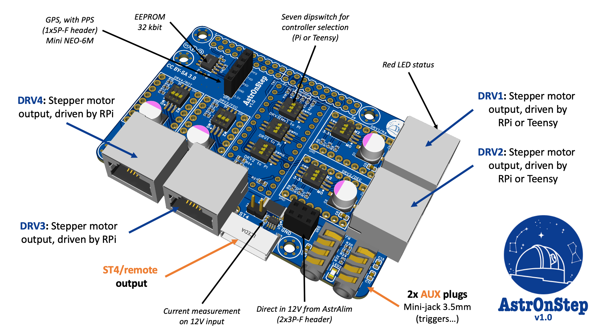

Project is published here : <https://oshwlab.com/pololamag/astronstep>

# Description

Designed for amateur astronomers and inspired by the [OnStep](https://onstep.groups.io/g/main) hardware solution, [AstrOnStep](https://oshwlab.com/pololamag/astronstep) is an add-on designed for the Raspberry Pi 5 or 4 minicomputer equipped with the [AstrAlim](https://oshwlab.com/pololamag/astralim) card, specifically designed to manage the motorized aspects of astrophotography sessions. The idea for this electronic card came from a few members of the [Vélizy astronomy club](https://www.astro-velizy.fr/) (France) who wanted to rationalize and simplify the use of cables for photography nocturnal deep sky, with an open source solution.
This is a computerized positioning system, usually for mounts equipped with stepper motors. The particularity of [AstrOnStep](https://oshwlab.com/pololamag/astronstep) is to offer the possibility of controlling 4 stepper motors (among others: mount/focuser/derotator/dome/darkboxes...), with the Raspberry Pi or with OnStep. [AstrOnStep](https://oshwlab.com/pololamag/astronstep), interfaced with a Pi 5 and [AstrAlim](https://oshwlab.com/pololamag/astralim) offers the following characteristics:

- Control of **two stepper motor drivers** exclusively by the Raspberry Pi.
- Control of **two stepper motor drivers** either by the on-board OnStep (based on the minipcb2 solution), or by the Raspberry Pi .
- Two auxiliary outputs controlled by OnStep.
- **A 5-pin female connector** for a **mini NEO-6M GPS module**, with a **PPS (Pulse Per Second)** output connected to the Raspberry Pi, providing precise time and positioning for mobile astrophotography sessions, as well than the precision required for occultation measurements.
- **A 32kbit EEPROM** allows the Raspberry Pi to recognize AstrAlim at startup and to execute the scripts necessary for its operation.

In short, with the Raspberry Pi 5 (or 4), the **AstrOnStep** + **AstrAlim** solution offers a reliable, flexible, powerful and energy-efficient solution, ideal for both fixed installations and mobile use . This card also allows you to forget about traditional and expensive proprietary systems, providing all the functions you could need to capture your most beautiful images.

The software is currently being developed and finalised on github. One of our medium-term objectives will be to combine this card with the equatorial mount [DHEM, for DIY Harmonic Equatorial Mount](https://github.com/polvinc/DHEM).

Some statistics: 4 layers of copper, 70 components, 2.8m of track, 59 vias, 389 pads, 28 resistors, 13 capacitors, 7 dipswitches, 2 LEDs...
